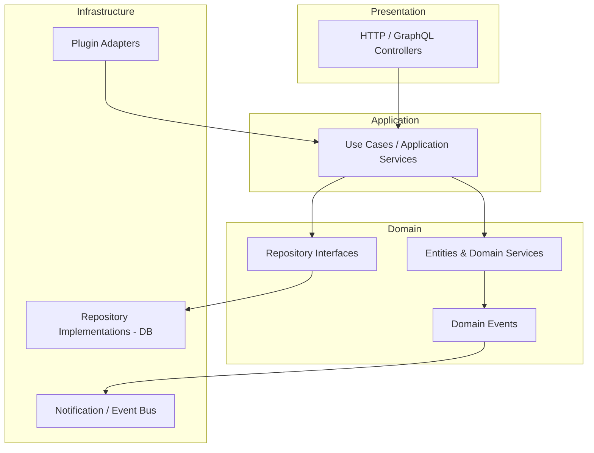

# Blog CMS

Layered architecture example service. Contains src/ and tests/ directories.

## Architecture (Layered)


  A --> B --> C
  B --> D
  D --> F
  C --> E --> G
  H --> B
```

See `docs/architecture.md` for more details.