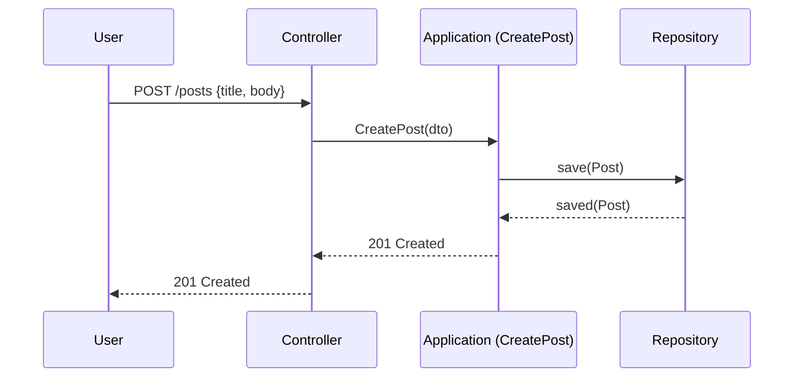

# Sequence Diagram

Sequence diagrams and workflows for the Blog CMS.

## CreatePost flow (Mermaid example)

```mermaid
sequenceDiagram
	participant U as User
	participant C as Controller
	participant A as Application (CreatePost)
	participant R as Repository

	U->>C: POST /posts {title, body}
	C->>A: CreatePost(dto)
	A->>R: save(Post)
	R-->>A: saved(Post)
	A-->>C: 201 Created
	C-->>U: 201 Created
```
